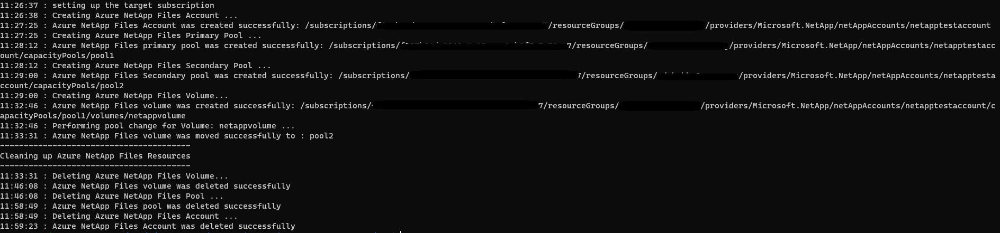

# Azure NetAppFiles Pool Change Script Sample for Azure CLI 

This project demonstrates how to use Azure CLI NetAppFile module to perform a pool change on a Volume for the Microsoft.NetApp
resource provider.

In this sample application we perform the following operations:

* Creations
    * Azure NetApp Files Account
    * Source Capacity Pool in service level Premium
    * Destination Capacity Pool in service level Standard
    * Volume in the source capacity pool
* Updates
    * Perform pool change, moving Volume from source capacity pool to the destination capacity pool
* Deletions
    * Volume
    * Source Capacity Pool
    * Destination Capacity Pool
    * Azure NetApp Files Account

>Note: The cleanup execution is disabled by default. If you want to run this end to end with the cleanup, please
>change value of boolean variable 'SHOULD_CLEANUP' in anf-pool-change.sh

If you don't already have a Microsoft Azure subscription, you can get a FREE trial account [here](http://go.microsoft.com/fwlink/?LinkId=330212).

## Prerequisites

1. Azure Subscription
1. Subscription needs to be enabled for Azure NetApp Files. For more information, please refer to [this](https://docs.microsoft.com/azure/azure-netapp-files/azure-netapp-files-register#waitlist) document.
1. Resource Group created
1. Virtual Network with a delegated subnet to Microsoft.Netapp/volumes resource. For more information, please refer to [Guidelines for Azure NetApp Files network planning](https://docs.microsoft.com/en-us/azure/azure-netapp-files/azure-netapp-files-network-topologies)
1. Make sure [Azure CLI](https://docs.microsoft.com/cli/azure/install-azure-cli) is installed.
1. Windows with WSL enabled (Windows Subsystem for Linux) or Linux to run the script. This was developed/tested on Ubuntu 18.04 LTS (bash version 4.4.20).
1. Make sure [jq](https://stedolan.github.io/jq/) package is installed before executing this script.

# What is netappfiles-cli-pool-change-script-sample doing? 

This sample is dedicated to demonstrating how to perform a pool change on a Volume in Azure NetApp Files.
This project will first create an ANF Account and then two Capacity Pools, one at a Premium service level tier, and another at a Standard service level tier.
Then it will create a single Volume in the Premium tier Capacity Pool.
Finally, the sample will perform the pool change operation on the Volume by moving it to the Standard tier Capacity Pool.

There is a section in the code dedicated to remove created resources. By default this sample will not remove all created resources;
this behavior is controlled by a string variable called 'SHOULD_CLEANUP' in the anf-pool-change.sh file. If you want to erase all resources right after the
creation operations, set this variable to 'true'.

# How the project is structured

The following table describes all files within this solution:

| Folder      | FileName                | Description                                                                                                                         |
|-------------|-------------------------|-------------------------------------------------------------------------------------------------------------------------------------|
| Root        | anf-pool-change.sh      | Authenticates and executes all operations                                                                                           |

# How to run the sample scipt

1. Clone it locally
    ```powershell
    git clone https://github.com/Azure-Samples/netappfiles-cli-pool-change-sample.git
    ```
1. Open a bash session and execute the following Run the script

	 * Change folder to **netappfiles-cli-pool-change-sample\src\**
	 * Open anf-pool-change-sh and edit all the parameters
	 * Save and close
	 * Run the following command
	 ``` bash
	 ./anf-pool-change.sh
	 ```

Sample output


# References

* [Dynamically change a service level of a volume](https://docs.microsoft.com/en-us/azure/azure-netapp-files/dynamic-change-volume-service-level)
* [Azure NetApp Files Az commands](https://docs.microsoft.com/en-us/cli/azure/netappfiles?view=azure-cli-latest)
* [Resource limits for Azure NetApp Files](https://docs.microsoft.com/en-us/azure/azure-netapp-files/azure-netapp-files-resource-limits)
* [Azure Cloud Shell](https://docs.microsoft.com/en-us/azure/cloud-shell/quickstart)
* [Download Azure SDKs](https://azure.microsoft.com/downloads/)
 
